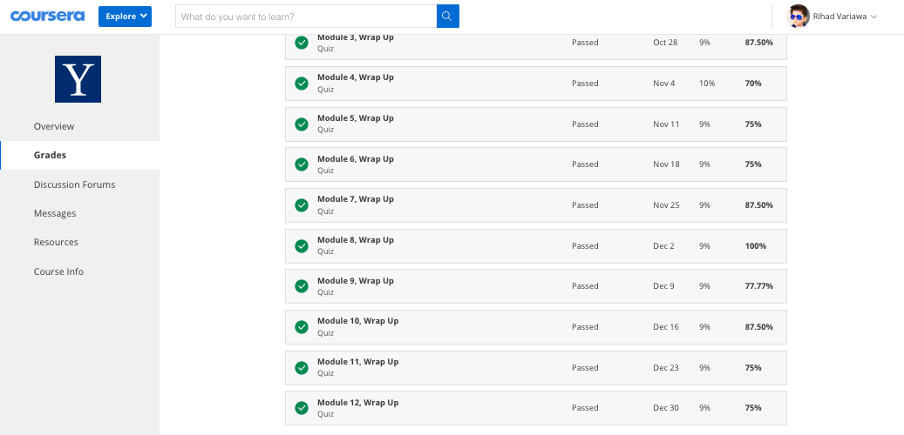

# Global-Financial-Crisis

### About this Course
Former U.S. Secretary of the Treasury Timothy F. Geithner and Professor Andrew Metrick survey the causes, events, policy responses, and aftermath of the recent global financial crisis.

